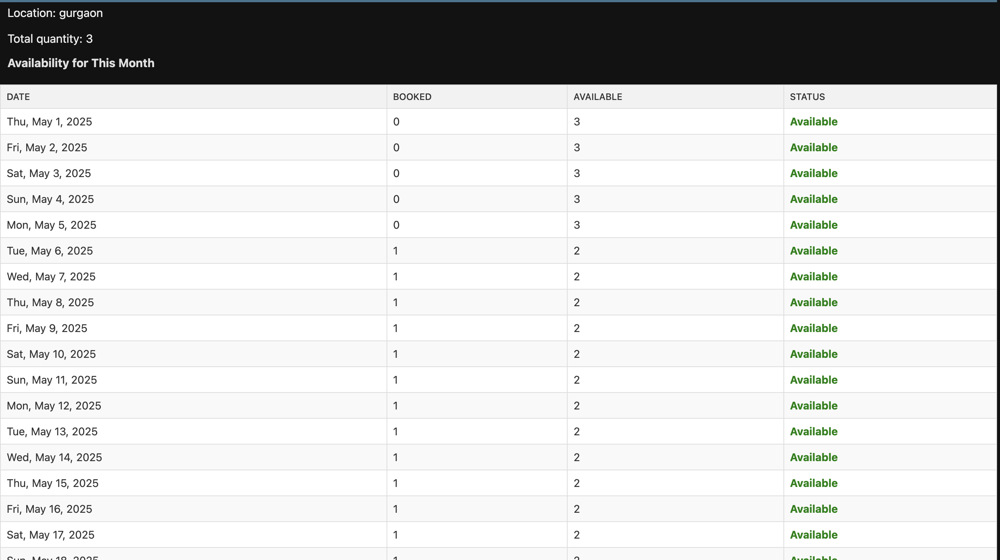

### Setup
# Clone repository
git clone https://github.com/your-repo/equipment-booking-system.git
cd equipment-booking-system

# Create virtual environment
python -m venv venv
source venv/bin/activate  # Linux/Mac
venv\Scripts\activate    # Windows

# Install dependencies
pip install -r requirements.txt

# Database setup
python manage.py makemigrations
python manage.py migrate

# Create admin user
python manage.py createsuperuser

# Set permissions (run once)
>>python manage.py shell
>>from bookings.admin import setup_all_permissions
>>setup_all_permissions()

or 
Set user with group and give permission yourself 

STAFF_STATUS SHOULD BE ACTIVE

## Features

### Equipment Availability View

### Equipment Booking View

### Core Functionality

- **User Management**

  - Role-based access (Admin, Manager, Employee)
  - Department assignment
  - Profile management

- **Equipment Management**

  - Equipment type categorization
  - Quantity tracking
  - Location management
  - Availability status (active/inactive)

- **Booking System**

  - Single and recurring bookings
  - Approval workflow
  - Conflict detection
  - Calendar availability view
  - Status tracking (Pending/Approved/Rejected/Completed)

- **Notifications**

  - Real-time booking alerts
  - Status change notifications
  - System announcements

- **Reporting**
  - Usage analytics
  - Equipment utilization
  - User activity

## API Endpoints

### Authentication

'/api/auth/ '- Built-in DRF authentication endpoints

### Users

| Endpoint           | Method    | Description    | Permissions |
| ------------------ | --------- | -------------- | ----------- |
| `/api/users/'      | GET       | List all users | Admin       |
| `/api/users/'      | POST      | Create user    | Admin       |
| `/api/users/{id}/' | GET       | User details   | Owner/Admin |
| `/api/users/{id}/' | PUT/PATCH | Update user    | Owner/Admin |
| `/api/users/{id}/' | DELETE    | Delete user    | Admin       |

### Equipment

| Endpoint                            | Method | Description              | Permissions |
| ----------------------------------- | ------ | ------------------------ | ----------- |
| `/api/equipment/ '                  | GET    | List equipment           | All         |
| `/api/equipment/'                   | POST   | Create equipment         | Admin       |
| `/api/equipment/{id}/'              | GET    | Equipment details        | All         |
| `/api/equipment/{id}/availability/' | GET    | Check availability       | All         |
| `/api/equipment/available/'         | GET    | List available equipment | All         |

### Bookings

| Endpoint                     | Method | Description              | Permissions         |
| ---------------------------- | ------ | ------------------------ | ------------------- |
| `/api/bookings/'             | GET    | List bookings            | Varies by role      |
| `/api/bookings/'             | POST   | Create booking           | Employee+           |
| `/api/bookings/{id}/'        | GET    | Booking details          | Owner/Manager/Admin |
| `/api/bookings/{id}/cancel/' | POST   | Cancel booking           | Owner/Manager/Admin |
| `/api/bookings/recurring/'   | POST   | Create recurring booking | Employee+           |

### Notifications

| Endpoint                      | Method | Description        |
| ----------------------------- | ------ | ------------------ |
| /api/notifications/           | GET    | User notifications |
| /api/notifications/mark-read/ | POST   | Mark as read       |

## Setup Instructions

### Prerequisites

- Python 3.8+
